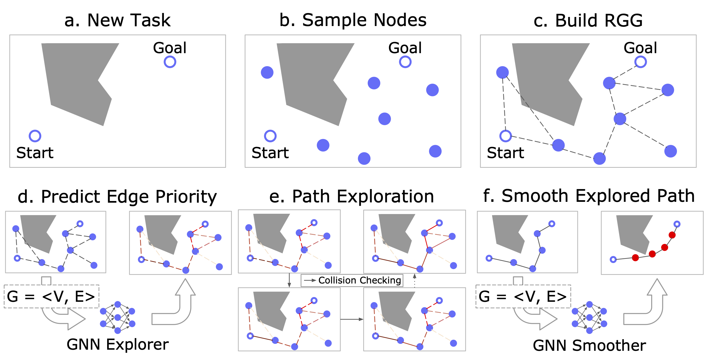
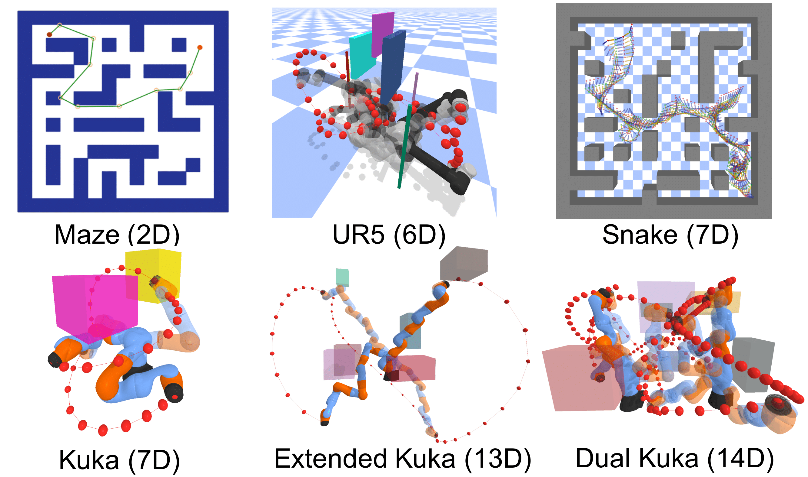

# GNN-Motion-Planning

[paper](https://rainorangelemon.github.io/NeurIPS2021/paper.pdf) | [website](https://rainorangelemon.github.io/NeurIPS2021/)

## Abstract



Sampling-based motion planning is a popular approach in robotics for finding paths in continuous configuration spaces. Checking collision with obstacles is the major computational bottleneck in this process. We propose new learning-based methods for reducing collision checking to accelerate motion planning by training graph neural networks (GNNs) that perform path exploration and path smoothing. Given random geometric graphs (RGGs) generated from batch sampling, the path exploration component iteratively predicts collision-free edges to prioritize their exploration. The path smoothing component then optimizes paths obtained from the exploration stage. The methods benefit from the ability of GNNs of capturing geometric patterns from RGGs through batch sampling and generalize better to unseen environments. Experimental results show that the learned components can significantly reduce collision checking and improve overall planning efficiency in challenging high-dimensional motion planning tasks.

## Environments

We provide 6 diverse environments from 2D mazes to 14D dual KUKA iiwa arms. We use PyBullet to perform collision detection and visualization.


## Installation
```bash
conda create -n gnnmp python=3.8
conda activate gnnmp
# install pytorch, modify the following line according to your environment
conda install pytorch torchvision torchaudio cudatoolkit=11.3 -c pytorch
# install torch geometric, refer to https://github.com/pyg-team/pytorch_geometric
conda install pyg -c pyg
pip install pybullet jupyterlab transforms3d matplotlib shapely descartes
```

## Download Extra Files for Training / Test
Please find the training and test sets in https://drive.google.com/drive/folders/1ADHjbmhT7OCFmOSLn4YDZF0CBmkmzLye?usp=sharing. Once the files are downloaded, put them under the `data/pkl` folder.

## Usage
See [main.ipynb](./main.ipynb) for further details.

Additionally, this repo also covers other popular approaches, including [PRM with Dijkstra](./algorithm/dijkstra.py), [RRT*](./algorithm/tsa.py), [BIT*](./algorithm/bit_star.py), [LazySP](./algorithm/lazy_sp.py), and [NEXT](./algorithm/tsa.py).

To evaluate all the methods, see [eval_all.py](./eval_all.py)

## Citation

We would appreciate it if you found this repo helpful. Feel free to cite:

```
@inproceedings{chenning2021collision,
    title={Reducing Collision Checking for Sampling-Based Motion Planning Using Graph Neural Networks},
    author={Yu, Chenning and Gao, Sicun},
    booktitle={Proceedings of the 35rd International Conference on Neural Information Processing Systems},
    year={2021}
}
```

## Acknowledgement

We sincerely thank the following GitHub repos:

[Learning to Plan in High Dimensions via Neural Exploration-Exploitation Trees](https://github.com/NeurEXT/NEXT-learning-to-plan)

[Gated Path Planning Networks](https://github.com/RLAgent/gated-path-planning-networks)

[PyBullet Planning](https://github.com/caelan/pybullet-planning)

[PyBullet](https://github.com/bulletphysics/bullet3)

[Path Planning](https://github.com/zhm-real/PathPlanning)
